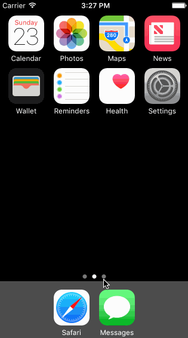

## Carousel

The purpose of this homework is to leverage views, view properties, and events to create a high fidelity prototype that is difficult to distinguish from a production app. We're going to use the techniques from this week to implement the Carousel app from the signed out state to the basic signed in state.

Time spent: `<Number of hours spent>`

### Features

### Required User Stories

1. Landing Screen
  - [!] Static photo tiles on the initial screen.
  - [ ] User can scroll to reveal sign in buttons.
1. Sign In
  - [ ] Tapping on email/password reveals the keyboard and shifts the scroll view and Sign In button up.
  - Upon tapping the Sign In button.
     - [ ] If the username or password fields are empty, user sees an error alert.
     - [ ] If credentials are incorrect, user sees a loading indicator for 2 seconds followed by an error alert.
     - [ ] If the credentials are correct, user sees a loading indicator for 2 seconds followed by a transition to the Sign In screens.
1. Tutorial Screens
  - [ ] User can page between the screens.
1. Image Timeline
  - [ ] Display a scrollable view of images.
  - [ ] User can tap on the conversations button to see the conversations screen (push).
  - [ ] User can tap on the profile image to see the settings view (modal from below).
1. Conversations
  - [ ] User can dismiss the conversations screen.
1. Settings
  - [ ] User can dismiss the settings screen.
  - [ ] User can log out.

### Optional User Stories

1. Landing Screen:  
  - [ ] Photo tiles move, scale and rotate while user scrolls.
1. Tutorial Screens:
  - [ ] User can page between the screens with updated dots.
  - [ ] Upon reaching the 4th page, the page indicator dots are hidden and "Take Carousel for a Spin" button is shown.

Please list two areas of the assignment you'd like to **discuss further with your peers** during the next class (examples include better ways to implement something, how to extend your app in certain ways, etc):

1.  I would like to know how implement UIPageControls in class. especially so that each page snaps to fit the screen while scrolling. 
 
 

Here's a walkthrough of implemented user stories:

